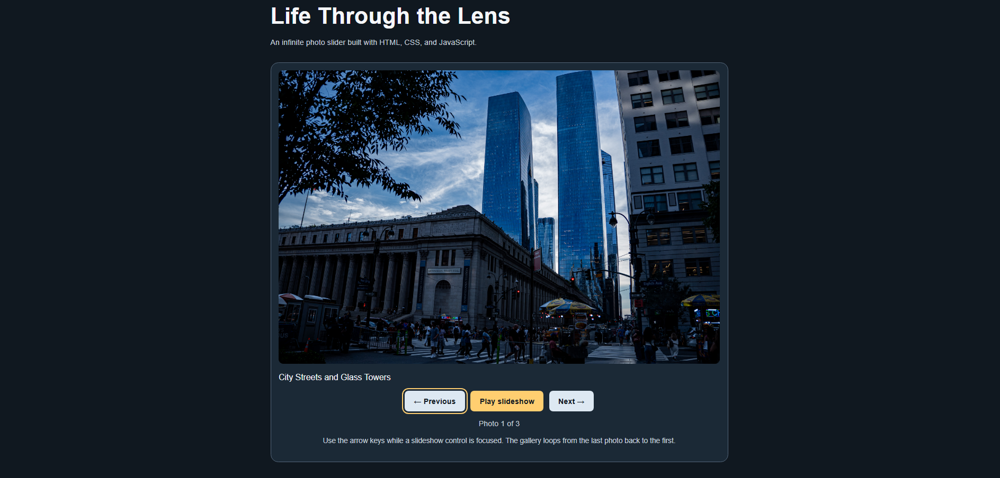

# Infinite Photo Slider

A responsive photography slideshow built with HTML, CSS, and
vanilla JavaScript for issue #954.

## Features

- Previous and Next controls with continuous looping.
- Optional automatic playback at four-second intervals.
- Play and Pause controls.
- Left and right arrow-key navigation when a control is focused.
- Descriptive image alternative text and captions.
- Visible keyboard focus indicators.
- Responsive layout for smaller screens.
- Playback pauses when the browser tab is hidden or keyboard
  focus enters the gallery from outside.

## Technologies and Dependencies

HTML, CSS, and JavaScript. No external libraries, frameworks,
API keys, package installation, or build tools are required.

## Run Locally

1. Download or clone the repository.
2. Open ImageSlider/cobie1818/index.html in a modern browser.
3. Keep the images folder beside index.html.

## Usage

Select Previous or Next to browse the photographs.
Select Play slideshow to advance automatically.
Select Pause slideshow to stop playback.

Use Tab to focus a control, then use the left and right arrow
keys to navigate. Manual navigation also pauses playback.

## Manual Testing

The following checks passed during local testing:

- Next wraps from the last photograph to the first.
- Previous wraps from the first photograph to the last.
- Playback advances photographs every four seconds.
- Pause stops automatic playback.
- Arrow keys navigate while a control is focused.
- The layout fits a narrow browser window without horizontal scrolling.

These are manual checks; this mini-project does not include
an automated test suite.

## Customization

Update the photos array in index.html to change image paths,
alternative text, and captions. Place additional images in
the images folder and add their entries to the array.

## Screenshot

## Related Issue

https://github.com/thinkswell/javascript-mini-projects/issues/954