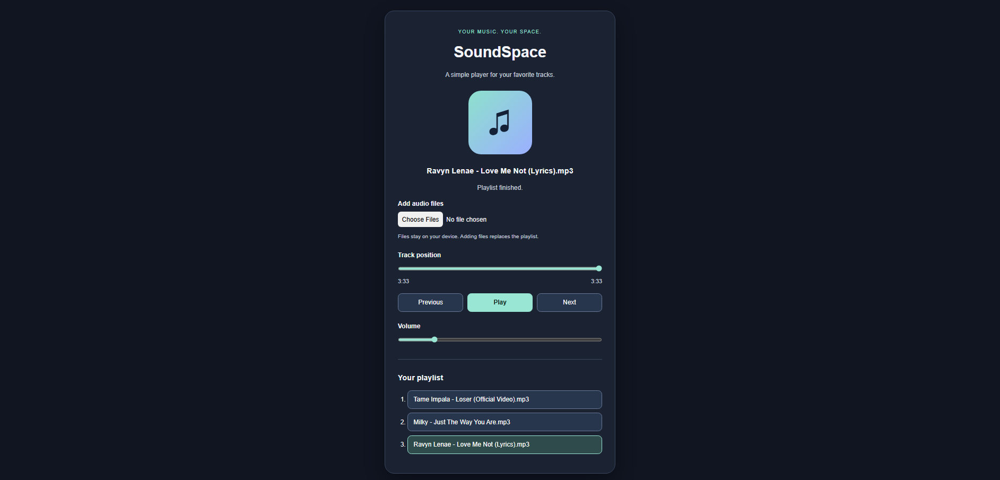

# SoundSpace Music Player

A responsive music player built for JavaScript Mini Projects.
Contribution related to issue #958.

## Technologies

- HTML5 audio
- CSS with a responsive layout
- Vanilla JavaScript
- No external libraries, API keys, or build tools required

## Run locally

Open index.html in a modern browser, or serve this folder using
the VS Code Live Server extension.

## How to use

1. Select Add audio files and choose audio files from your device.
2. Use Ctrl or Shift in the file picker to select multiple files.
3. Click Play to begin playback.
4. Use Previous, Next, or a playlist button to select a track.
5. Adjust the track position and volume using the sliders.

Adding a new selection replaces the playlist.
Files are processed locally and are not uploaded.
The playlist is cleared when the page reloads.

## Features

- Play and pause
- Previous and next track navigation with wraparound
- Automatic advancement until the end of the playlist
- Clickable playlist with the selected track highlighted
- Track seeking and elapsed time display
- Volume control
- Responsive layout
- Keyboard-operable buttons and labeled controls
- Visible keyboard focus and playback status messages
- Error feedback for files the browser cannot play

## Manual testing checklist

- Add one file and test play, pause, seeking, and volume.
- Add multiple files and test previous, next, and track selection.
- Confirm navigation wraps around at the playlist boundaries.
- Confirm playback advances when a track ends.
- Confirm playback stops after the final track.
- Replace the playlist while music is playing.
- Try an unsupported or damaged audio file.
- Test keyboard navigation using Tab, Enter, Space, and arrow keys.
- Check the layout at phone, tablet, and desktop widths.
- Check the browser console for unexpected errors.

## Limitations

Supported audio formats depend on the browser.
Audio files are supplied by the user; no songs are bundled.
No automated test suite is included in this contribution.

## Screenshot

