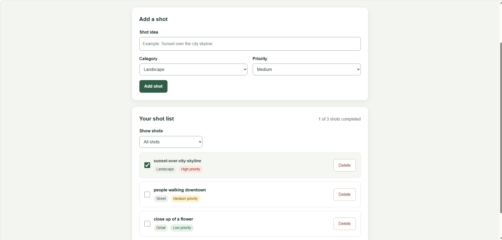

# Photo Shot List Planner

A responsive photography planning app built with HTML, CSS, and vanilla
JavaScript. Photographers can organize shot ideas before a trip or photo
session and track which shots they have completed.

## Features

- Add shots with a title, category, and priority.
- Reject empty and whitespace-only titles.
- Mark shots as completed or pending.
- Filter by all, pending, or completed shots.
- Delete individual shots.
- Display a completed-shot counter.
- Save the list in localStorage between page visits.
- Adapt the layout to desktop and mobile screens.

## Technologies

- HTML5 for page structure and form controls
- CSS3 for styling and responsive layouts
- Vanilla JavaScript for interactions and list management
- Browser localStorage for persistence

No framework, package installation, API key, or database is required.
VS Code's Live Server extension is used for local development.

## Run Locally

1. Clone or download the repository.
2. Open the repository folder in VS Code.
3. Install the Live Server extension if it is not already installed.
4. Navigate to PhotoShotListPlanner/cobie1818.
5. Right-click index.html and select "Open with Live Server."

## How to Use

1. Enter a shot idea.
2. Select its category and priority.
3. Click "Add shot."
4. Use a shot's checkbox to toggle its completion status.
5. Use "Show shots" to filter the list.
6. Click "Delete" to remove an unwanted shot.

## Data Storage

The list is saved in the current browser on the current device.
It does not synchronize between browsers or devices. Clearing browser
site data removes the saved list.

The app displays a message if stored data cannot be loaded or changes
cannot be saved. User-entered titles are displayed as text rather
than interpreted as HTML.

## Manual Testing

The following checks were performed in Microsoft Edge:

- Adding shots with different categories and priorities
- Completing shots and returning them to pending
- Updating the completion counter
- Filtering completed and pending shots
- Retaining the list and completion status after refresh
- Rejecting empty and whitespace-only titles
- Adding and deleting a temporary shot
- Inspecting the responsive layout at a 375-pixel viewport width

No automated tests are included with this contribution.

## Screenshot

## Related Issue

https://github.com/thinkswell/javascript-mini-projects/issues/1245

## Author

Jacobie Jackson (cobie1818)