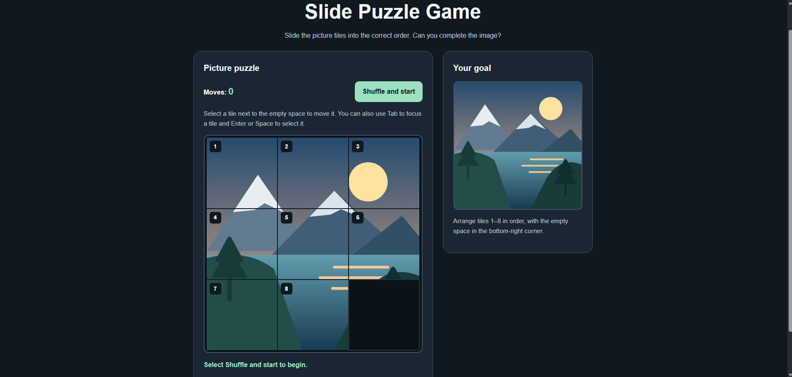

# Slide Puzzle Game

A responsive picture sliding puzzle built with HTML, CSS, and
vanilla JavaScript.

Created for issue #822:
https://github.com/thinkswell/javascript-mini-projects/issues/822

## Features

- A 3 × 3 board with eight picture tiles and one empty space.
- An original SVG landscape with a complete reference image.
- Solvable shuffling using legal moves from the completed board.
- A move counter that increases only after valid moves.
- Completion detection and a message showing the final move count.
- Mouse, touch, and keyboard controls.
- A responsive layout for desktop and mobile screens.
- No external libraries or image downloads.

## Run Locally

1. Download or clone the repository.
2. Open SlidePuzzleGame/cobie1818/index.html in a modern browser.

For development, you can also open index.html using the
Live Server extension in VS Code.

No package installation or build step is required.

## How to Play

1. Select "Shuffle and start."
2. Select a tile directly above, below, left, or right of the
   empty space to move it.
3. Arrange tiles 1–8 in order, leaving the empty space in the
   bottom-right corner.
4. Use the reference picture as a guide.

For keyboard controls, press Tab to focus a tile and press
Enter or Space to select it.

Select "Shuffle and start" again to begin a new puzzle.
Refreshing the page returns the game to its initial state.

## Project Files

- index.html — Page structure and accessible controls.
- style.css — Styling, focus indicators, and responsive layout.
- script.js — Picture, board state, movement, shuffle, and win detection.
- screenshot.png — Preview of the application.

## Testing

Testing is manual; this mini-project does not include an
automated test suite.

### Manual Test Checklist

- Before starting, selecting a tile does not move it.
- Shuffling produces an unsolved board with a move count of zero.
- An adjacent tile moves into the empty space.
- A valid move increases the counter by exactly one.
- A nonadjacent tile does not move or increase the counter.
- Enter and Space activate focused tiles.
- Keyboard focus remains on the moved tile.
- Restarting reshuffles the board and resets the counter.
- At 375 pixels wide, the panels stack without horizontal scrolling.
- Completing the puzzle displays the correct move count.
- After completion, tiles remain unchanged until a new game starts.

### Controlled Win Test

On the local game page, enter the following in the browser console:

tiles = [1, 2, 3, 4, 5, 6, 7, 0, 8];
moves = 0;
isPlaying = true;
renderBoard();

Select tile 8. The expected result is a completed board,
a move count of 1, and this message:

"Puzzle complete! You finished in 1 move."

This setup changes only the current browser session.
Refresh the page to return to the initial state.

## Deployment

This mini-project consists of static files and can be served
by a static web host. It has no backend or build process.

Running it with Live Server is local development, not public deployment.

## Screenshot
